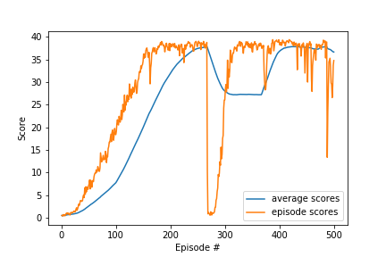

# Report

## Learning Algorithm

We used a model [Deep Deterministic Policy Gradient(DDPG)](https://arxiv.org/pdf/1509.02971.pdf) model.  
The model is a mix between Actor Critic and DQN for continuous action space problems.  
The actor produces a deterministic policy instead of a stochastic policy and the critic evaluates it.  
To stabilize the learning, the model implements Fixed targets and Experience Replay  originally used for DQN where for Fixed targets, every network gets a target for a certain time and for Experience Replay, we store a buffer of experiences and we learn from them in a shuffled order to fight against the correlation between the sequence of experiences appeared over time.  
Another technique called soft update is used: Instead of copying the weights of the online network to make the target network we add 99.99% of the target network weights are added to 0.01% of the online network weights.

### Hyperparameters
- BUFFER_SIZE = 1e6, replay buffer size
- BATCH_SIZE = 256, minibatch size
- GAMMA = 0.99, discount factor
- TAU = 1e-3, for soft update of target parameters
- LR_ACTOR = 1e-4, learning rate of the actor 
- LR_CRITIC = 1e-3, learning rate of the critic
- WEIGHT_DECAY = 0, L2 weight decay

### Actor Neural Network
The neural network defined in model.py has 3 fully connected layers.
- A first layer of size state_size with a Relu activation function
- A second layer of size 256 with a Relu activation function
- A third layer of size action_size with a Tanh activation function.

### Critic Neural Network
The neural network defined also in model.py has 4 fully connected layers.
- A layer of size state_size with a leaky_relu activation function
- A layer of size 256 with leaky_relu activation function
- A layer of size 256 with leaky_relu activation function
- A layer of size 1 with no activation function

## Plot of rewards



```

Episode 1	Average Score: 0.535
Episode 2	Average Score: 0.486
Episode 3	Average Score: 0.389
Episode 4	Average Score: 0.468
Episode 5	Average Score: 0.506
Episode 6	Average Score: 0.499
.
.
.
Episode 122	Average Score: 10.920
Episode 123	Average Score: 11.103
Episode 124	Average Score: 11.291
Episode 125	Average Score: 11.449
Episode 126	Average Score: 11.625
Episode 127	Average Score: 11.815
Episode 128	Average Score: 12.007
.
.
.
Episode 286	Average Score: 29.809
Episode 287	Average Score: 29.866
Episode 288	Average Score: 29.926
Episode 289	Average Score: 29.983
Episode 290	Average Score: 30.033
Environment solved in 290 episodes!


```

## Ideas for Future Work
We can improve this algorithm using [D4PG](https://openreview.net/forum?id=SyZipzbCb) or [PPO](https://arxiv.org/pdf/1707.06347) that is usually very good in continuous tasks.

## Experiments
| Plot | Hyperparameters | Interpretation | Code |
| --- | --- | --- | --- |
|  |  | The agent learns correctly and converges rapidly in 60 episodes | [link](https://github.com/dhaw92/ContinuousControl/tree/experiment-1)
|  | Same as experiment 1, we just removed the critic clipping line | The agent learns correctly and converges rapidly in 60 episodes | [link](https://github.com/dhaw92/ContinuousControl/tree/experiment-2)
